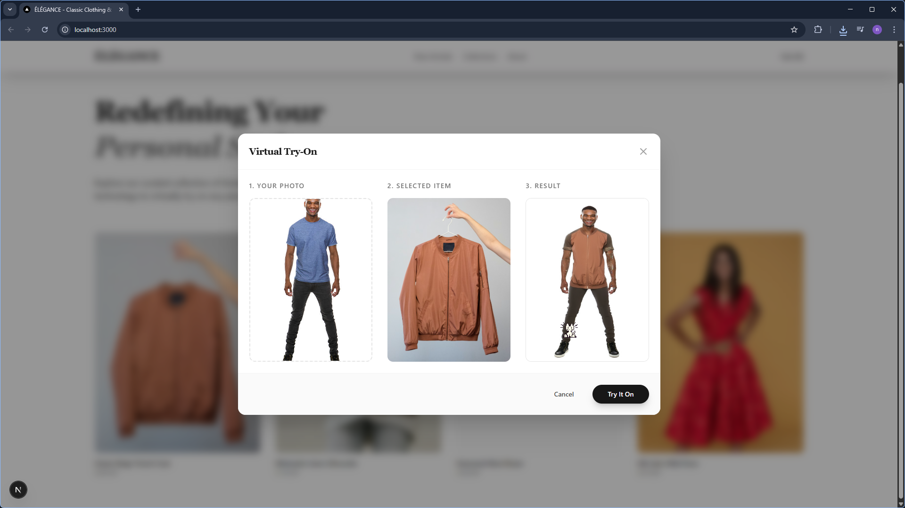

# ÉLÉGANCE - Classic Clothing & Virtual Try-On



A lightweight, premium e-commerce storefront featuring a "Virtual Try-On" integration powered by a Digital Ocean ComfyUI GPU utilizing the IDM-VTON model. 

Built with Next.js (App Router) and Tailwind CSS. The unified Next.js API route architecture safely handles the image processing pipeline between the user and the remote GPU server, hiding the server IPs from the client browser.

## Tech Stack
- **Frontend**: React, Next.js (App Router), Tailwind CSS
- **Backend Integration**: Next.js API Routes (`/api/try-on`)
- **Virtual Try-On Backend**: ComfyUI (running on a Digital Ocean GPU Droplet)

## Getting Started for Developers

To run this project locally, you will need Node.js and npm installed.

### 1. Installation
Clone the repository and install the NPM dependencies:

```bash
git clone <your-repo-url>
cd Trial_on
npm install
```

### 2. Environment Setup
You must configure the environment variables so the Next.js API route knows where to send the images to process the Virtual Try-On workflow. 

1. Copy the example `.env` file:
   ```bash
   cp .env.example .env.local
   ```
2. Open `.env.local` and add the public IP/URL of the Digital Ocean ComfyUI GPU server:
   ```ini
   COMFYUI_API_URL=http://<your-droplet-ip>:8188
   ```
*(Note: If testing without a live ComfyUI instance, the app will gracefully throw an error when attempting a Virtual Try-On, but the storefront UI will remain locally navigable.)*

### 3. Running the Development Server
Start the local development server:

```bash
npm run dev
```

Open [http://localhost:3000](http://localhost:3000) with your browser to see the result.

## ComfyUI Workflow Integration (`deploy1.json`)
This Next.js application requires a specific ComfyUI workflow to process IDM-VTON correctly. The integration logic is mapped inside `src/app/api/try-on/route.ts` and expects nodes based on the `deploy1.json` graph:
- **Node 14**: Load Human Image
- **Node 15**: Load Garment Image
- **Node 29**: GroundingDino Segmenter (Receives dynamic mask prompt, e.g., "shirt", "dress", "coat" based on UI selection)
- **Node 35**: IDM-VTON Core Execution
- **Node 21**: Output Saved Image

## License
This project is licensed under the [MIT License](LICENSE).
